# <h1 align='center'> Extract, Transform, Load: Chicago Public School Data</h1>

### Contributors

Kathleen Graham, Mohammed Sajid Khan, Tamara Najjar


### SEARCH


First, we searched data.gov for data sets around Chicago Public Schools:
* [School Profiles](https://catalog.data.gov/dataset/chicago-public-schools-school-profile-information-sy1718)
* [School Progress Reports](https://catalog.data.gov/dataset/chicago-public-schools-school-progress-reports-sy1718)
* [School Locations](https://catalog.data.gov/dataset/chicago-public-schools-school-locations-sy1819)

We also included a data set around fast food restaurants to map using zip codes.
* [Fast Food Restaurants](https://data.world/datafiniti/fast-food-restaurants-across-america)


### EXTRACT / TRANSFORM


Using Jupyter Notebook, we read our files using pandas and stored in dataframes. Then we cleaned and renamed columns to be ready for loading into the database. The steps to set up, extract, and transform are as follows: 


#### Set Up

```python
# import dependencies
import pandas as pd
from sqlalchemy import create_engine
```


#### School Profile Information (2017-2018)

```python
# extract school profile information from csv file and display in dataframe
school_profiles_file = "data/cps-school-profile-info-17-18.csv"
school_profiles_df = pd.read_csv(school_profiles_file)
school_profiles_df.head(3)
```
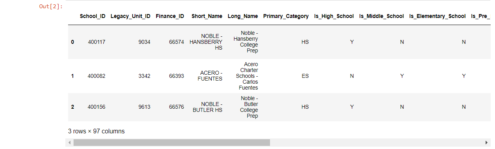


```python
# transform school profiles dataframe
profiles_df = school_profiles_df[['School_ID', 'Finance_ID', 'Short_Name', 'Long_Name', 'Zip Codes', 'Wards']]
profiles_df.head(3)
```


```python
# renamed columns of school profile dataframe
profiles_mapping = {
    'School_ID': 'school_id',
    'Finance_ID': 'finance_id',
    'Short_Name': 'short_name',
    'Long_Name': 'long_name',
    'Zip Codes': 'zip',
    'Wards': 'ward'
}

mapped_profiles = profiles_df.rename(columns=profiles_mapping)
mapped_profiles.head(3)
```


#### School Reports Information (2017-2018)

```python
# extract school reports
school_reports_file = "data/cps-school-progress-reports-17-18.csv"
school_reports_df = pd.read_csv(school_reports_file)
school_reports_df.head(3)
```
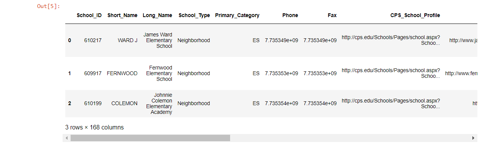


```python
# transform school reports data frame
reports_df = school_reports_df[['School_ID', 'Short_Name', 'Supportive_School_Award']]
reports_df.head(3)
```


```python
# renamed columns of school reports data frame
reports_mapping = {
    'School_ID': 'school_id',
    'Short_Name': 'short_name',
    'Supportive_School_Award': 'award'
}

mapped_reports = reports_df.rename(columns=reports_mapping)
mapped_reports.head(3)
```


#### School Locations (2017-2018)

```python
# extract school locations
school_locations_file = "data/cps-school-locations-17-18.csv"
school_locations_df = pd.read_csv(school_locations_file)
school_locations_df.head(3)
```
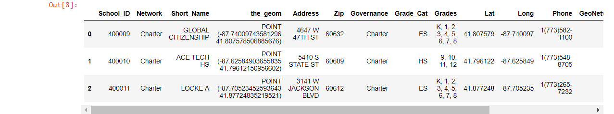


```python
# transform school locations data frame
locations_df = school_locations_df[['School_ID', 'Network', 'Short_Name', 'Address', 'Zip', 'Grades', 'COMMAREA', 'WARD_15', 'ALD_15']]
locations_df.head(3)
```
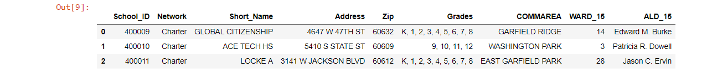


```python
# renamed columns of school locations data frame
locations_mapping = {
    'School_ID': 'school_id',
    'Network': 'network',
    'Short_Name': 'short_name',
    'Address': 'address',
    'Zip': 'zip', 
    'Grades': 'grades',
    'COMMAREA': 'community',
    'WARD_15': 'ward',
    'ALD_15': 'alderman'
}

mapped_locations = locations_df.rename(columns=locations_mapping)
mapped_locations.head(3)
```


#### Fast Food Restaurants in Chicago by Zip Code


```python
# extract FastFood profile information from csv file and display in dataframe
fast_food_file = "data/fast-food.csv"
fast_food_df = pd.io.parsers.read_csv(fast_food_file,encoding = 'unicode_escape',dtype={'postalCode': 'str'})
fast_food_df.head(3)
```
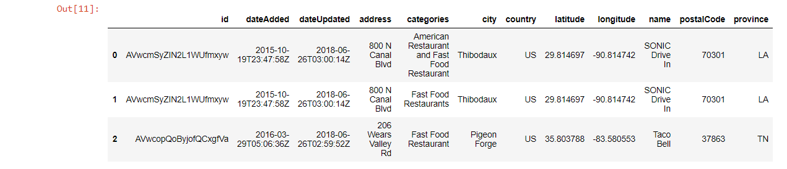


```python
# just look at Chicago
fast_food = fast_food_df.loc[fast_food_df['city']=='Chicago']

# remove duplicates
fast_food = fast_food.drop_duplicates('id')

# transform
fastfood = fast_food[['name', 'postalCode', 'province']]
fastfood.head(3)
```


```python
fastfood_mapping = {
    'name':'name',
    'postalCode':'zip', 
    'province':'state'
}

mapped_fastfood = fastfood.rename(columns=fastfood_mapping)
mapped_fastfood.head(3)
```


### LOAD


Using PostgreSQL in pdAdmin, we created tables to match the data frames we finished transforming. We had a few hiccups with foreign key restraints, so we trimmed it down to using school_id as the primary key and having only two foreign keys map to this.

#### Database Creation

1. Created 'chicago_public_school' database
2. In a query tool, created four tables to match transformed data frames

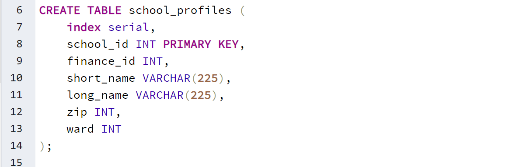


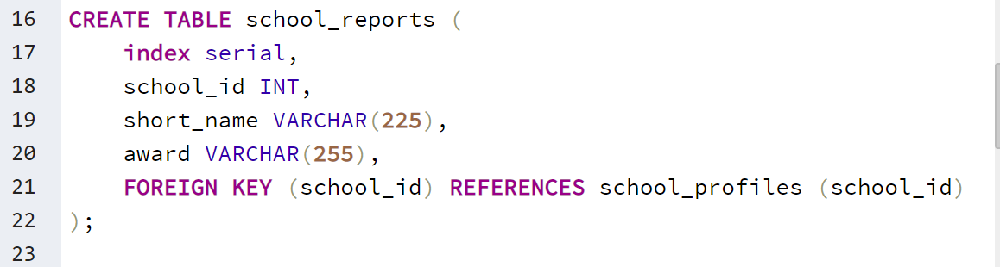


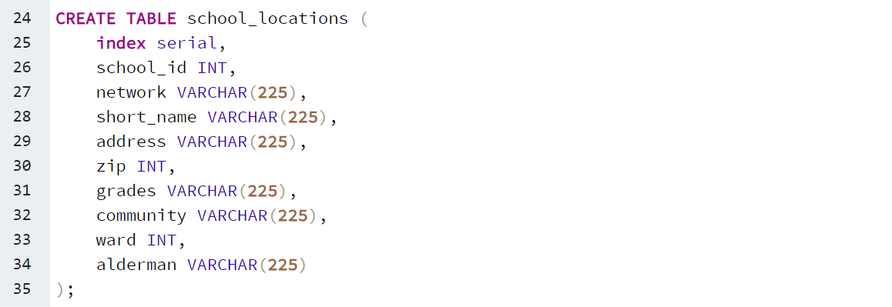


#### Database Connection

Going back to our Jupyter Notebook, we set up a connection to our database.

```python
# set up a database connection
rds_connection_string = "postgres:postgres@localhost:5432/chicago_public_school"
engine = create_engine(f'postgresql://{rds_connection_string}')
```


```python
# confirm tables
engine.table_names()
```


#### Load Dataframes into Database

From Jupyter Notebook, we were able to write our data frames to our relational database (PostgreSQL) using pandas .to_sql and SQLAlchemy's engine. 

```python
# load school profiles
mapped_profiles.to_sql(name='school_profiles', con=engine, if_exists='append', index=True)
```

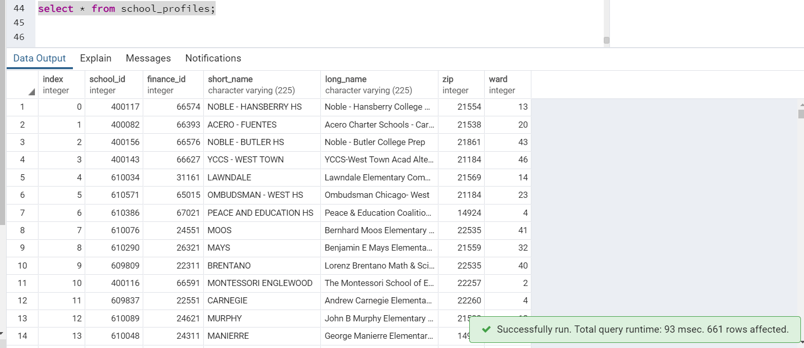


```python
# load school reports
mapped_reports.to_sql(name='school_reports', con=engine, if_exists='append')
```

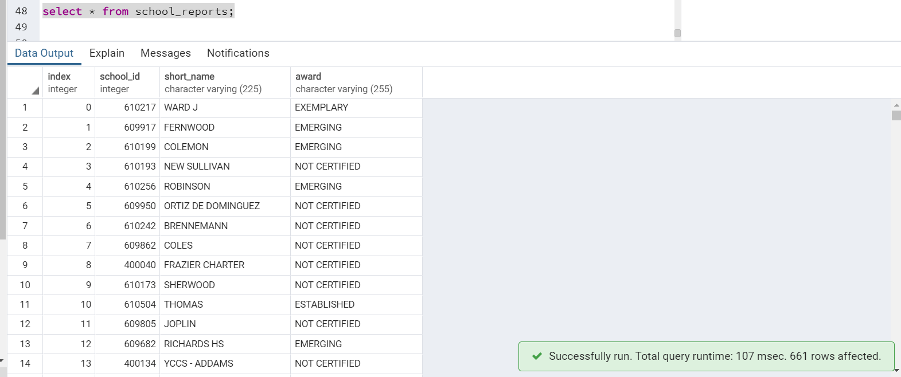


```python
# load school locations
mapped_locations.to_sql(name='school_locations', con=engine, if_exists='append')
```

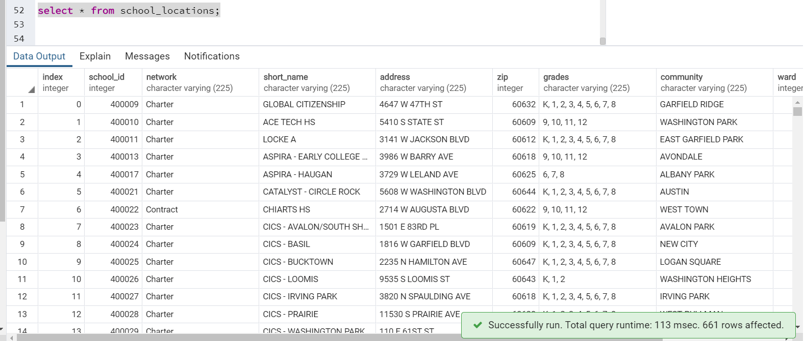


```python
# load fast food
mapped_fastfood.to_sql(name='fast_food', con=engine, if_exists='append')
```

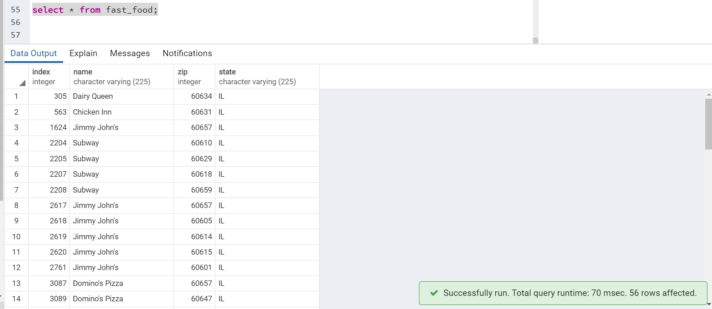


